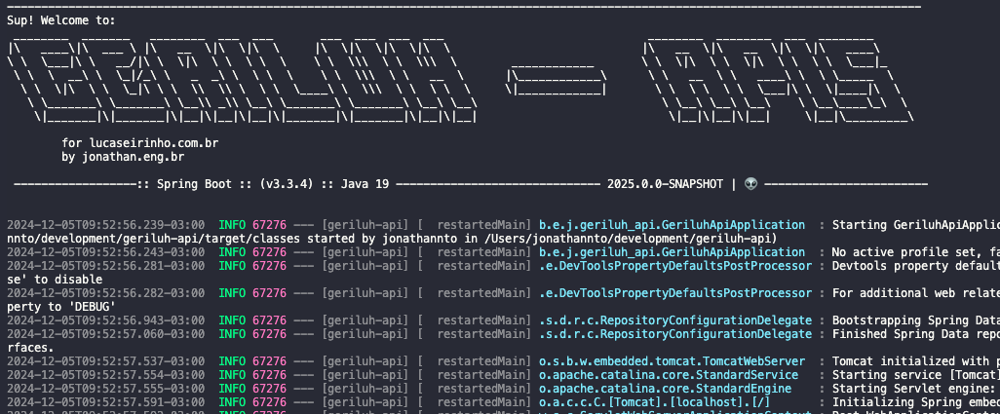

# Welcome to the Geriluh Micro-ERP API Repository!

This GitHub repository contains the source code for Geriluh's API, a comprehensive and customizable business management system designed specifically for the needs of small and medium-sized businesses like Lu Caseirinho.

## What is Geriluh?

Geriluh stands for "Gerenciamento de Pequenas Empresas Lu Caseirinho" (Portuguese for "Lu Caseirinho Small Business Management"). It is a micro-ERP, a lightweight and focused alternative to traditional, complex enterprise resource planning systems.

## Key Features:

Geriluh offers a powerful suite of features to manage various aspects of your business, including:

- **Sales and Invoicing:** 
  Create quotes, sales orders, invoices, track cash flow, and generate sales reports.
- **Inventory:**
  Control product inventory, perform stock ins and outs, set reorder points, and monitor stock levels.
- **Purchasing:**
  Create purchase requisitions, place purchase orders, track product receipts, and manage suppliers.
- **Finance:**
  Control accounts payable and receivable, perform bank reconciliations, monitor cash flow, and generate financial reports.
- **Customers and Contacts:**
  Store customer and contact information, manage leads, track interaction history, and run marketing campaigns.
- **Reports:**
  Generate customized reports on sales, inventory, finance, customers, and other areas of your business.

## Technology Stack:

Geriluh is built using modern and reliable technologies, ensuring high performance and scalability:

**Programming Language:** Java
**Web Framework:** Spring Ecosystem (Boot, DataJpa, Security)
**Database:** Postgresql
**Migrations:** Flyway
**Docs:** Swagger
**Server:** Heroku

## License:

Geriluh is licensed under the Apache 2.0 License. This license grants users extensive freedom to use, modify, and distribute the software, including for commercial purposes.

Getting Started:

To install and run Geriluh on your local environment, follow the instructions in the INSTALL.md file.

Contributing:

The community is welcome to contribute to the development of Geriluh. To learn how to contribute, read the CONTRIBUTING.md file.

Documentation:

Comprehensive documentation for Geriluh is available at https://jonathan.eng.br

Support:

For support, you can join the Geriluh community forum at https://jonathan.eng.br

Embrace Efficient Business Management with Geriluh!

The Geriluh Development Team
